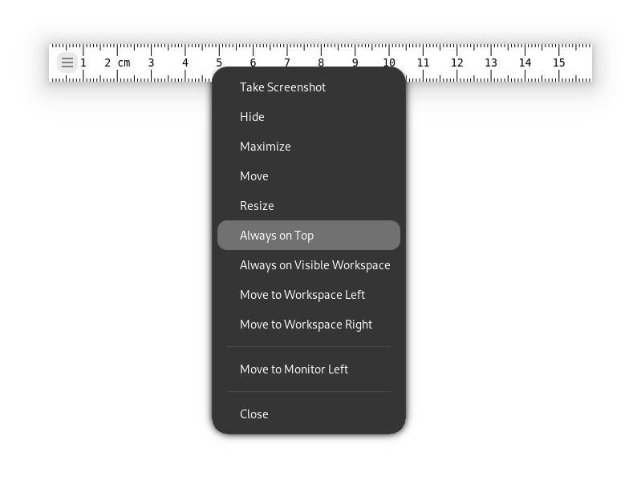

# Length - A Ruler to Measure Objects on Screen

Length is a GNOME application that enables you to measure distances on screen.
You can use it to design and inspect layouts and graphics.

Length supports pixels, centimeters, inches, and percentages for the ruler markings.
You can change the orientation of the markings from left-to-right to right-to left, and you can also introduce an offset to change the point of origin.

You can make the ruler semi-transparent to help you measure objects behind the ruler, and you can track the pointer position.
You can also change the color and font.

You can change the size and orientation of the ruler by dragging the ruler corners (see [changing orientation](https://github.com/herve4m/length/blob/main/data/media/screenshots/orientation.gif))

Length is inspired by several projects including [KRuler](https://apps.kde.org/kruler/) and [ScreenRuler](https://gnomecoder.wordpress.com/screenruler/)

## Adjusting the Ruler with GNOME

To accurately measure objects, you might have to adjust the position on the ruler.
One method is to move the ruler while pressing <kbd>Ctrl</kbd>.
When you get close to a window side, the ruler side snaps to the window.

You can also move the ruler by using the arrow keys.
Press <kbd>Alt</kbd>+<kbd>F7</kbd> and use the arrow keys to move the ruler.
For accurate adjustment, press <kbd>Ctrl</kbd> while moving the ruler with the arrow keys.

To prevent the object to measure from covering the ruler, right click the ruler and select `Always on Top`.

## Contributing to the Project

We welcome community contributions to this project.
If you find problems, then please open an [issue](https://github.com/herve4m/length/issues) or create a [pull request](https://github.com/herve4m/length/pulls).

More information about contributing can be found in the [Contribution Guidelines](https://github.com/herve4m/length/blob/main/CONTRIBUTING.md).

## Release Notes

See the [changelog](https://github.com/herve4m/length/blob/main/CHANGELOG.rst).

## Licensing

GNU General Public License v3.0 or later.

See [LICENSE](https://www.gnu.org/licenses/gpl-3.0.txt) to read the full text.
